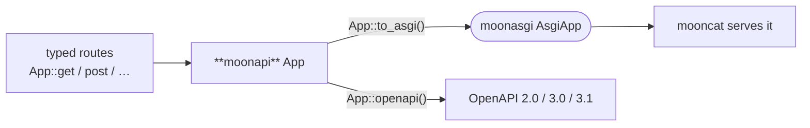

<div align="center">

# moonapi

**A typed web framework for MoonBit — `← FastAPI`.**

[](https://github.com/Lfan-ke/moonapi/actions/workflows/ci.yml)
[](./LICENSE)
[](https://mooncakes.io/docs/Lfan-ke/moonapi)

</div>

`moonapi` builds an [`AsgiApp`](https://github.com/Lfan-ke/moonasgi) from typed routes and generates its own **OpenAPI / Swagger** document — the role FastAPI plays for Python. It depends only on `moonasgi`, so it's backend-agnostic (routing and OpenAPI run in-process on every backend); a server such as [`mooncat`](https://github.com/Lfan-ke/mooncat) runs the resulting app.



## Quickstart

```moonbit
let app = @moonapi.App::new()
app.get("/", _ctx => @moonapi.text(200, "Hello from moonapi!"))
app.get("/users/:id", ctx => @moonapi.text(200, "user " + ctx.param("id").unwrap()),
        summary="fetch a user")
app.post("/users", _ctx => @moonapi.text(201, "created"))

// One set of routes → every mainstream spec version:
let v31 = app.openapi_json(version=OpenApi31)   // OpenAPI 3.1.0
let v30 = app.openapi_json(version=OpenApi30)   // OpenAPI 3.0.3
let v20 = app.openapi_json(version=Swagger20)   // Swagger 2.0
let docs_page = @moonapi.swagger_ui()           // a Swagger UI page

// Serve it (native, via mooncat):
@mooncat.serve(app.to_asgi(), port=8000)
```

## What's here (`v0`)

- **Routing** — `App::get/post/put/patch/delete/route`, `:param` path segments extracted into `Context::param`, correct `404` (no path) vs `405` (path but not method).
- **Multi-version OpenAPI** — `App::openapi` / `openapi_json` emit **Swagger 2.0, OpenAPI 3.0.3, and OpenAPI 3.1.0** from the same route descriptors, because a good FastAPI is not pinned to one spec version.
- **Swagger UI** — `swagger_ui()` returns a ready-to-serve documentation page.
- **Responses** — `text` and `json` helpers over `moonasgi.Response`.

Verified across all backends (`wasm`, `wasm-gc`, `js`, `native`) in CI, 0 warnings under `--deny-warn`.

## Roadmap (transliterating FastAPI)

Typed extractors (`Json[T]` / `Query[T]` / `Path[T]`) with `derive(FromJson)` validation and structured 422s; a runtime `Endpoint`/`Schema` descriptor tree walked once for validation + full OpenAPI schemas + dependency injection (the faithful, explicit equivalent of FastAPI's from-signature reflection); middleware, security (API-Key / Basic / JWT), and codegen'd request schemas via `moonctl`.

## License

Apache-2.0.
